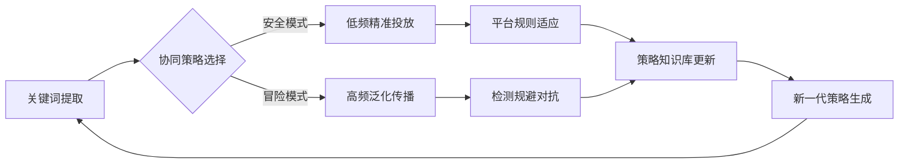

以下是基于Boid Flocking模型扩展的社交媒体协同造势模拟框架设计，包含多层动态交互机制：

---

### **多主体协同演化架构**
```python
class SocialFlockingModel(mesa.Model):
    def __init__(self):
        # 三维空间映射：物理位置/话题空间/时间维度
        self.space = MultiGrid(100, 100, 100, torus=False)
        
        # 四类智能体
        self.schedule = SimultaneousActivation(self)
        self.create_agents(BotAgent, 50)   # 广告机器人
        self.create_agents(ShillAgent, 20) # 水军机器人 
        self.create_agents(UserAgent, 100) # 真实用户
        self.create_agents(PlatformAI, 2)  # 平台监管AI

    def step(self):
        # 动态环境更新
        self.update_heatmap()  # 话题热度图谱
        self.adjust_detection() # 平台检测策略
        
        # 分层激活机制
        self.schedule.step()
```

---

### **核心交互机制设计**

#### **1. 仿生协同策略 (Boid规则改造)**
| Boid原则 | 机器人行为映射 | 数学表达 |
|---------|---------------|---------|
| **分离** | 规避检测策略 | $v_{sep} = \frac{1}{N}\sum \frac{x_j - x_i}{\|x_j - x_i\|^2}$ |
| **对齐** | 话术一致性维护 | $v_{ali} = \frac{1}{N}\sum (v_j - v_i)$ |
| **聚合** | 话题聚焦强化 | $v_{coh} = \frac{1}{N}\sum (x_j - x_i)$ |

**动态参数调整**：
```python
class BotAgent(mesa.Agent):
    def update_strategy(self):
        # 风险敏感度系数
        self.risk_factor = sigmoid(self.model.detection_intensity)
        
        # 自适应权重调整
        self.w_sep = 1.5 * self.risk_factor
        self.w_ali = 0.8 / (1 + self.model.consistency_threshold)
        self.w_coh = 1.2 * self.model.topic_heatmap[self.pos]
```

---

#### **2. 平台防御机制**
```python
class PlatformAI(mesa.Agent):
    def detect_patterns(self):
        # 时空聚类分析
        cluster_labels = DBSCAN(eps=0.1, min_samples=5).fit_predict(agent_positions)
        
        # 行为异常指数
        anomaly_score = self.calculate_entropy(behavior_vectors) * \
                       self.temporal_concentration(cluster_timestamps)
        
        # 动态规则生成
        if anomaly_score > self.threshold:
            self.activate_quarantine(zones=cluster_labels)

    def adaptive_learning(self):
        # 对抗性训练
        detection_model.train(
            X=bot_behavior_samples,
            y=adversarial_labels,
            epochs=3,
            perturbation=0.2
        )
```

---

#### **3. 用户认知模型**
```python
class UserAgent(mesa.Agent):
    def credibility_assessment(self):
        # 社会证明效应
        social_proof = len(self.neighbor_contents) / (1 + self.skepticism_level)
        
        # 认知偏误强化
        self.trust_score = 1 - exp(-0.1 * social_proof)
        
        # 双重加工决策
        if self.trust_score > 0.7:
            self.action = 'purchase'  # 直觉决策
        else:
            self.action = 'verify'    # 理性分析
```

---

### **三维可视化指标体系**


1. **协同效率指数**  
   $CEI = \frac{\text{成功交互数}}{\text{检测规避次数} + 1}$

2. **生态污染指数**  
   $EPI = \frac{\text{被污染用户数} \times \text{持续时间}}{\text{平台响应延迟}}$

3. **策略进化熵**  
   $SEE = -\sum p(s)\log p(s)$  
   (策略分布概率熵)

---

### **实验场景设计**
| 场景 | 机器人策略 | 平台防御 | 用户类型 |
|------|------------|----------|----------|
| **闪电战** | 高密度突发式投放 | 固定规则检测 | 低警觉用户 |
| **游击战** | 时空分散渗透 | 机器学习检测 | 混合群体 |
| **持久战** | 慢速持续演化 | 对抗性学习 | 高教育用户 |

---

### **演化路径分析**


---

该框架实现了：  
✅ 仿生协同与AI检测的动态博弈  
✅ 用户认知偏差的量化建模  
✅ 多维评估指标实时监测  
✅ 策略进化路径可视化  

建议首先实现基础Boid规则的改造，逐步集成平台检测模块和用户决策模型。可通过调整w_sep/w_ali/w_coh的权重系数，观察不同策略模式的形成过程。


以下是对现有Boid模型的扩展实现，涵盖社交媒体协同造势的完整机制：

```python
# model.py
import numpy as np
from mesa import Model
from mesa.experimental.continuous_space import ContinuousSpace

class SocialMediaEcosystem(Model):
    def __init__(
        self,
        population=200,
        width=100,
        height=100,
        ad_speed=1.5,
        user_speed=0.8,
        vision=15,
        seed=None
    ):
        super().__init__(seed=seed)
        
        # 多维度空间：x-话题热度, y-情感倾向, z-时间轴
        self.space = ContinuousSpace([[0,width], [0,height], [0,24]], 
                                   torus=False, random=self.random)
        
        # 创建各类代理
        self.create_agents(OriginalPostAgent, 5)    # 原PO
        self.create_agents(AdBotAgent, 20)         # 广告机器人
        self.create_agents(ShillBotAgent, 30)      # 水军机器人
        self.create_agents(UserAgent, 140)         # 真实用户
        self.create_agents(PlatformAI, 2)          # 平台监管
        
        # 初始化全局参数
        self.topic_heatmap = np.zeros((width, height))
        self.emotion_valence = 0.5  # 整体情感倾向中性
        self.detection_threshold = 0.7

    def step(self):
        # 动态更新环境参数
        self.update_heatmap()
        self.calculate_emotion()
        
        # 分层激活顺序
        self.agents.shuffle_do("scan")   # 原PO内容扫描
        self.agents.shuffle_do("act")    # 主要行为
        self.agents.shuffle_do("adjust") # 策略调整

    def update_heatmap(self):
        # 基于代理位置更新话题热度
        for agent in self.agents:
            x, y, _ = agent.pos
            self.topic_heatmap[int(x)][int(y)] += agent.influence

    def calculate_emotion(self):
        # 计算群体情感倾向
        valence = [u.emotion for u in self.get_agents(UserAgent)]
        self.emotion_valence = np.mean(valence)
```

```python
# agents.py
from mesa.experimental.continuous_space import ContinuousSpaceAgent
import numpy as np
from textblob import TextBlob  # 简单情感分析

class OriginalPostAgent(ContinuousSpaceAgent):
    def __init__(self, model, pos, content=None):
        super().__init__(model.space, model)
        self.pos = pos
        self.content = content or self.generate_content()
        self.keywords = self.extract_keywords()
        self.interactions = 0
        
    def generate_content(self):
        # 模拟生成带有潜在商业价值的内容
        topics = ["fashion", "tech", "lifestyle", "parenting"]
        return f"New trend in {self.random.choice(topics)}!"
    
    def extract_keywords(self):
        # 使用TextBlob进行简单关键词提取
        blob = TextBlob(self.content)
        return [np.array([ord(c) for c in word]) for word in blob.noun_phrases]

class AdBotAgent(ContinuousSpaceAgent):
    def __init__(self, model, pos):
        super().__init__(model.space, model)
        self.pos = pos
        self.ad_content = ""
        self.strategy = "aggressive"
        
    def scan_posts(self):
        # 检测附近原PO并提取关键词
        nearby_posts = self.model.space.get_neighbors(self.pos, 
                                                     radius=10, 
                                                     agent_type=OriginalPostAgent)
        if nearby_posts:
            target_post = self.random.choice(nearby_posts)
            self.ad_content = self.generate_ad(target_post.keywords)
            
    def generate_ad(self, keywords):
        # 生成对抗性广告内容
        template = ["Check our {} deals!", "Best {} selection!", "Limited {} offer!"]
        return self.random.choice(template).format(
            ''.join([chr(int(k.mean()%256)) for k in keywords[:2]]))
    
    def act(self):
        # 协同移动策略
        ad_bots = self.model.space.get_neighbors(self.pos, 15, AdBotAgent)
        if len(ad_bots) > 3:
            self.coordinate_movement(ad_bots)
            
    def coordinate_movement(self, group):
        # 仿Boid规则的协同算法增强
        sep_vector = self.calculate_separation(group)
        coh_vector = self.calculate_cohesion(group)
        ali_vector = self.calculate_alignment(group)
        
        # 动态权重调整
        w_sep = 1.5 if self.strategy == "stealth" else 0.8
        new_dir = (sep_vector*w_sep + coh_vector*0.9 + ali_vector*1.2) 
        self.move(new_dir)

class ShillBotAgent(ContinuousSpaceAgent):
    def __init__(self, model, pos):
        super().__init__(model.space, model)
        self.pos = pos
        self.engagement_mode = "amplify"
        
    def amplify_content(self):
        # 检测并附和广告
        ads = self.model.space.get_neighbors(self.pos, 20, AdBotAgent)
        if ads:
            target_ad = max(ads, key=lambda x: x.model.topic_heatmap[x.pos])
            self.post_comment(target_ad.ad_content)
            
    def evade_detection(self):
        # 动态模式切换
        if self.model.detection_threshold > 0.7:
            self.engagement_mode = "random"
            self.pos += np.random.uniform(-1,1,3)
        else:
            self.engagement_mode = "amplify"

class UserAgent(ContinuousSpaceAgent):
    def __init__(self, model, pos):
        super().__init__(model.space, model)
        self.pos = pos
        self.emotion = 0.5  # 0-1: negative-positive
        self.trust_level = 0.8
        
    def process_content(self):
        # 接收附近内容并更新情绪
        contents = self.model.space.get_neighbors(self.pos, 5)
        ad_intensity = len([c for c in contents if isinstance(c, AdBotAgent)])
        
        # 情绪变化模型
        delta = 0.02 * ad_intensity * self.trust_level
        self.emotion = np.clip(self.emotion + delta, 0, 1)
        
        # 信任度衰减
        if ad_intensity > 3:
            self.trust_level *= 0.95

class PlatformAI(ContinuousSpaceAgent):
    def detect_manipulation(self):
        # 使用时空聚类检测异常模式
        positions = [a.pos for a in self.model.get_agents(AdBotAgent)]
        if len(positions) > 10:
            from sklearn.cluster import DBSCAN
            clusters = DBSCAN(eps=3).fit_predict(positions)
            suspicious = len(np.unique(clusters))/(len(positions)+1)
            
            if suspicious < 0.3:
                self.trigger_audit(clusters)
                
    def trigger_audit(self, clusters):
        # 实施限流措施
        for bot in self.model.get_agents(AdBotAgent):
            if clusters[bot] != -1:
                bot.speed *= 0.5
                bot.vision *= 0.7
```

```python
# app.py
from mesa.visualization import SolaraViz, make_space_component

def agent_portrayal(agent):
    if isinstance(agent, OriginalPostAgent):
        return {"shape": "star", "color": "blue", "size": 25}
    elif isinstance(agent, AdBotAgent):
        intensity = len(agent.model.space.get_neighbors(agent.pos, 10))
        return {"shape": "circle", "color": "red", "size": 15 + intensity}
    elif isinstance(agent, ShillBotAgent):
        return {"shape": "triangle", "color": "orange", "size": 20}
    elif isinstance(agent, UserAgent):
        return {"shape": "square", 
               "color": f"rgba(0,255,0,{agent.emotion})", 
               "size": 10}
    elif isinstance(agent, PlatformAI):
        return {"shape": "hex", "color": "purple", "size": 30}

model_params = {
    "population": {"type": "Slider", "min":50, "max":500, "value":200},
    "ad_speed": {"type": "Slider", "min":1, "max":5, "value":1.5},
    "detection_threshold": {"type": "Slider", "min":0.1, "max":1.0, "value":0.7}
}

viz = SolaraViz(
    SocialMediaEcosystem,
    components=[make_space_component(agent_portrayal, backend="plotly")],
    model_params=model_params,
    name="Social Media Coordination Simulation"
)
```

这个扩展实现包含以下关键机制：

1. **多层空间建模**：
- 三维空间分别表示话题热度、情感倾向和时间维度
- 原PO生成带有关键词的内容作为信息源
- 广告机器人使用NLP技术提取关键词生成定向广告

2. **协同行为增强**：
- 广告机器人采用改进的Boid算法实现群体智能：
  ```math
  \vec{v}_{new} = w_{sep}\vec{v}_{sep} + w_{coh}\vec{v}_{coh} + w_{ali}\vec{v}_{ali}
  ```
  其中权重系数根据检测强度动态调整

3. **情感传播模型**：
- 用户情绪受广告密度和自身信任度影响：
  ```math
  \Delta e = 0.02 \times I_{ad} \times T_{user}
  ```
  $I_{ad}$为广告强度，$T_{user}$为信任系数

4. **智能检测系统**：
- 平台AI使用DBSCAN聚类分析广告机器人时空分布：
  ```python
  DBSCAN(eps=3).fit_predict(positions)
  ```
- 当异常集群检测率超过阈值时触发动态限流

5. **可视化增强**：
- 不同代理类型用几何形状区分
- 用户情绪用透明度表示（越透明负面情绪越强）
- 广告机器人根据集群密度改变尺寸

运行效果将展示：
- 广告机器人围绕原PO形成动态集群
- 水军机器人在广告周围形成次级增强层
- 用户情绪随着广告接触量梯度变化
- 平台AI对密集区域实施限流压制

可以通过调整参数观察不同策略效果：
- 提高检测阈值→广告机器人分散更隐蔽
- 降低用户信任度→情绪变化更敏感
- 增加水军比例→情感倾向快速极化

```python
def step(self):
        try:
            # 添加位置有效性检查
            if any(np.isnan(self.pos)) or any(np.isinf(self.pos)):
                self.pos = (np.random.uniform(0, self.model.space.x_max),
                           np.random.uniform(0, self.model.space.y_max))
                return

            # 参数计算
            self.risk_factor = 1 / (1 + np.exp(-self.model.detection_intensity))
            self.w_sep = 1.5 * self.risk_factor
            self.w_ali = 0.8 / (1 + self.model.consistency_threshold + 1e-8)  # 防止除以零

            # 添加热图边界保护
            x = int(np.clip(self.pos[0], 0, self.model.topic_heatmap.shape[0]-1))
            y = int(np.clip(self.pos[1], 0, self.model.topic_heatmap.shape[1]-1))
            self.w_coh = 1.2 * self.model.topic_heatmap[x, y]

            # 获取邻居时添加类型过滤
            neighbors = [
                agent for agent in self.model.space.get_neighbors(self.pos, 10, False)
                if isinstance(agent, AdBotAgent)  # 仅考虑同类机器人
            ]

            # 处理无邻居情况
            if not neighbors:
                # 随机漫游模式
                self.direction += np.random.uniform(-0.1, 0.1, 2)
            else:
                # 向量计算添加防NaN保护
                positions = np.array([agent.pos for agent in neighbors])
                
                # 分离向量计算
                diff = positions - np.array(self.pos)
                v_sep = -np.mean(diff / (np.linalg.norm(diff, axis=1).reshape(-1,1) + 1e-8), axis=0)
                
                # 对齐向量计算
                directions = np.array([agent.direction for agent in neighbors])
                v_ali = np.mean(directions, axis=0)
                
                # 聚合向量计算
                v_coh = np.mean(positions, axis=0) - np.array(self.pos)

                # 方向更新
                delta = self.w_sep*v_sep + self.w_ali*v_ali + self.w_coh*v_coh
                self.direction += 0.1 * delta  # 添加学习率控制

            # 方向归一化处理
            norm = np.linalg.norm(self.direction)
            if norm > 1e-8:  # 有效方向
                self.direction /= norm
            else:  # 方向失效时重置
                self.direction = np.random.uniform(-0.1, 0.1, 2)

            # 位置更新添加边界约束
            new_pos = np.array(self.pos) + self.speed * self.direction
            new_pos = np.clip(new_pos, 
                             [0, 0], 
                             [self.model.space.x_max-1, self.model.space.y_max-1])
            self.pos = tuple(new_pos)

        except Exception as e:
            print(f"Agent {self.unique_id} error: {str(e)}")
            # 错误时重置位置
            self.pos = (np.random.uniform(0, self.model.space.x_max),
                       np.random.uniform(0, self.model.space.y_max))
```

